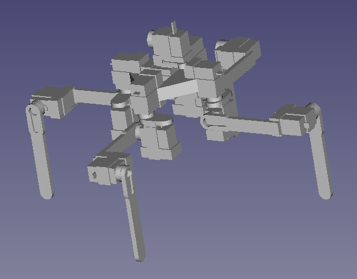

This is a quadrupedal robot!
It has radial symmetry and is moved using exclusively SG90 servo motors.

<picture>
 
</picture>

If you have any feedback please feel free to talk about it here!

An arduino with a Mega Sensor shield is used to control the servos. The arduino is connected to mains power and the servos are connected to a 3.7V battery power supply with 3 drone batteries in parallel.
